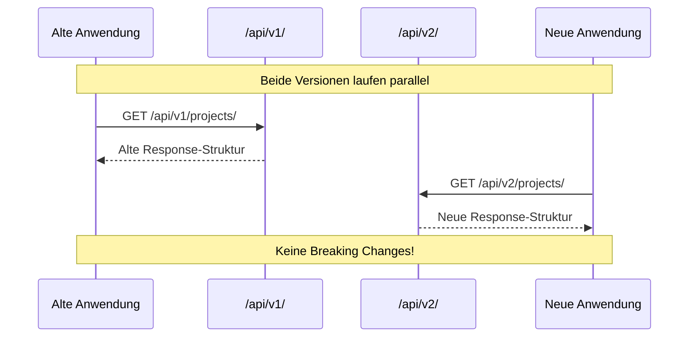
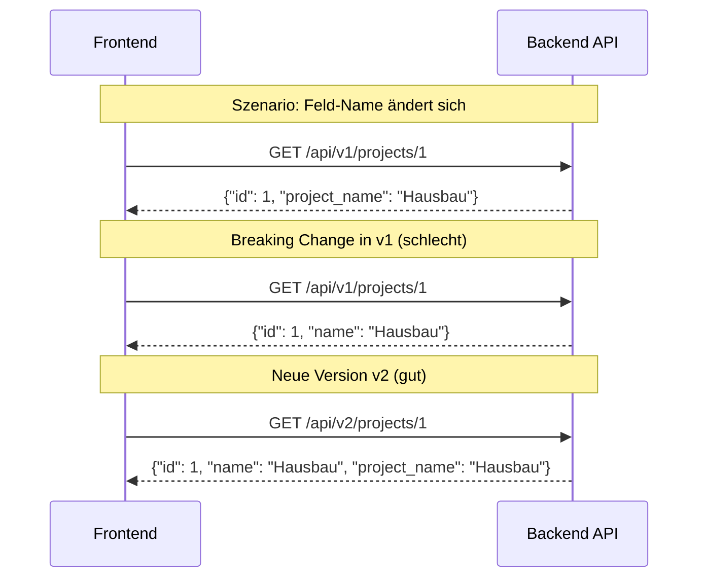
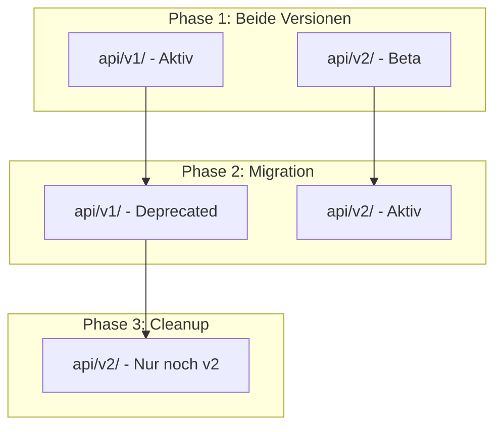
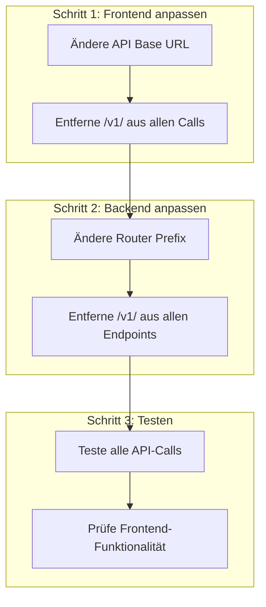

# API-Versionierung: Warum `/api/v1/`?

## Was bedeutet "v1"?

Das "v1" steht für **Version 1** der API und ist eine bewährte Praxis in der API-Entwicklung.

## Warum API-Versionierung wichtig ist

### **1. Rückwärtskompatibilität**
```mermaid
graph LR
    subgraph "Version 1 (Aktuell)"
        V1[api/v1/projects/]
        V1Response[{"id": 1, "name": "Projekt"}]
    end
    
    subgraph "Version 2 (Zukunft)"
        V2[api/v2/projects/]
        V2Response[{"id": 1, "name": "Projekt", "new_field": "value"}]
    end
    
    subgraph "Alte Clients"
        OldClient[Frontend v1.0]
        OldClient --> V1
    end
    
    subgraph "Neue Clients"
        NewClient[Frontend v2.0]
        NewClient --> V2
    end
```

### **2. Sichere Evolution der API**


## Aktuelle API-Struktur in BuildWise

```mermaid
graph TB
    subgraph "API Endpoints"
        AuthAPI[/api/v1/auth/]
        ProjectsAPI[/api/v1/projects/]
        TasksAPI[/api/v1/tasks/]
        DocumentsAPI[/api/v1/documents/]
        QuotesAPI[/api/v1/quotes/]
        MessagesAPI[/api/v1/messages/]
        MilestonesAPI[/api/v1/milestones/]
        CostPositionsAPI[/api/v1/cost-positions/]
        BuildWiseFeesAPI[/api/v1/buildwise-fees/]
        UsersAPI[/api/v1/users/]
    end

    subgraph "Frontend Services"
        AuthService[Auth Service]
        ProjectService[Project Service]
        TaskService[Task Service]
        DocumentService[Document Service]
        QuoteService[Quote Service]
        MessageService[Message Service]
        MilestoneService[Milestone Service]
        CostPositionService[Cost Position Service]
        BuildWiseFeeService[BuildWise Fee Service]
        UserService[User Service]
    end

    AuthService --> AuthAPI
    ProjectService --> ProjectsAPI
    TaskService --> TasksAPI
    DocumentService --> DocumentsAPI
    QuoteService --> QuotesAPI
    MessageService --> MessagesAPI
    MilestoneService --> MilestonesAPI
    CostPositionService --> CostPositionsAPI
    BuildWiseFeeService --> BuildWiseFeesAPI
    UserService --> UsersAPI
```



## Kann das "v1" weggelassen werden?

### **Technisch: JA**
```python
# Aktuell in app/main.py
app.include_router(auth.router, prefix="/api/v1/auth", tags=["auth"])
app.include_router(projects.router, prefix="/api/v1/projects", tags=["projects"])

# Könnte geändert werden zu:
app.include_router(auth.router, prefix="/api/auth", tags=["auth"])
app.include_router(projects.router, prefix="/api/projects", tags=["projects"])
```

### **Praktisch: NEIN** - Hier ist warum:

## Vorteile der Versionierung

### **1. Zukunftssicherheit**
```mermaid
graph LR
    subgraph "Heute"
        Current[api/v1/projects/]
        CurrentResponse[{"id": 1, "name": "Projekt"}]
    end
    
    subgraph "Morgen"
        Future[api/v2/projects/]
        FutureResponse[{"id": 1, "name": "Projekt", "owner": "User", "status": "active"}]
    end
    
    subgraph "Clients"
        OldApp[Alte App]
        NewApp[Neue App]
    end
    
    OldApp --> Current
    NewApp --> Future
```

### **2. Breaking Changes vermeiden**


### **3. Graduelle Migration**


## Praktische Beispiele

### **Beispiel 1: Feld-Änderung**
```json
// API v1 (aktuell)
{
  "id": 1,
  "project_name": "Hausbau",
  "budget": 100000
}

// API v2 (zukünftig)
{
  "id": 1,
  "name": "Hausbau",           // Feld geändert
  "budget": 100000,
  "currency": "EUR",           // Neues Feld
  "status": "active"           // Neues Feld
}
```

### **Beispiel 2: Endpunkt-Änderung**
```python
# API v1
@app.get("/api/v1/projects/{project_id}")
def get_project(project_id: int):
    return {"id": project_id, "name": "Projekt"}

# API v2
@app.get("/api/v2/projects/{project_id}")
def get_project_v2(project_id: int, include_tasks: bool = False):
    project = {"id": project_id, "name": "Projekt"}
    if include_tasks:
        project["tasks"] = get_project_tasks(project_id)
    return project
```

## Implementierung in BuildWise

### **Aktuelle Konfiguration:**
```python
# app/main.py
from fastapi import FastAPI
from app.api import auth, projects, tasks, documents, quotes, messages, milestones, cost_positions, buildwise_fees, users

app = FastAPI(title="BuildWise API", version="1.0.0")

# Alle Router mit v1 Prefix
app.include_router(auth.router, prefix="/api/v1/auth", tags=["auth"])
app.include_router(projects.router, prefix="/api/v1/projects", tags=["projects"])
app.include_router(tasks.router, prefix="/api/v1/tasks", tags=["tasks"])
# ... weitere Router
```

### **Frontend-Konfiguration:**
```typescript
// Frontend/Frontend/src/api/api.ts
export const getApiBaseUrl = () => {
  const hostname = window.location.hostname;
  if (hostname === 'localhost' || hostname === '127.0.0.1') {
    return 'http://localhost:8000/api/v1';  // v1 explizit
  }
  return `http://${hostname}:8000/api/v1`;
};
```

## Migration-Strategie

### **Wenn Sie v1 entfernen möchten:**



### **Konkrete Änderungen:**

**Backend (app/main.py):**
```python
# Vorher:
app.include_router(auth.router, prefix="/api/v1/auth", tags=["auth"])

# Nachher:
app.include_router(auth.router, prefix="/api/auth", tags=["auth"])
```

**Frontend (src/api/api.ts):**
```typescript
// Vorher:
const baseUrl = 'http://localhost:8000/api/v1';

// Nachher:
const baseUrl = 'http://localhost:8000/api';
```

## Empfehlung

### **Für BuildWise empfehle ich:**

1. **Behalten Sie v1** für die aktuelle Entwicklung
2. **Implementieren Sie v2** wenn größere API-Änderungen anstehen
3. **Dokumentieren Sie** die Versionierung in der API-Dokumentation

### **Warum v1 beibehalten:**
- ✅ **Zukunftssicherheit** für API-Änderungen
- ✅ **Professionelle Standards** in der API-Entwicklung
- ✅ **Einfache Migration** zu v2 wenn nötig
- ✅ **Keine Breaking Changes** für bestehende Clients

### **Nur entfernen wenn:**
- ❌ Sie sind sich sicher, dass die API nie geändert wird
- ❌ Sie haben keine externen Clients
- ❌ Sie sind bereit für potenzielle Breaking Changes

## Fazit

Das "v1" ist eine **bewährte Praxis** und sollte beibehalten werden. Es kostet fast nichts, bietet aber große Vorteile für die Zukunft der API. Für BuildWise empfehle ich, die Versionierung zu behalten. 