# BuildWise SaaS-Plattform - Umfassendes Handbuch

## 📋 Inhaltsverzeichnis

1. [Plattform-Übersicht](#plattform-übersicht)
2. [Technische Architektur](#technische-architektur)
3. [Benutzerrollen und Workflows](#benutzerrollen-und-workflows)
4. [API-Dokumentation](#api-dokumentation)
5. [Datenbank-Schema](#datenbank-schema)
6. [Sicherheit und DSGVO](#sicherheit-und-dsgvo)
7. [Deployment und DevOps](#deployment-und-devops)
8. [Monitoring und Wartung](#monitoring-und-wartung)
9. [Troubleshooting](#troubleshooting)
10. [Entwicklung und Erweiterung](#entwicklung-und-erweiterung)

---

## 🏗️ Plattform-Übersicht

### Was ist BuildWise?

BuildWise ist eine **DSGVO-konforme SaaS-Plattform** für Immobilienprojekte, die Bauherren und Dienstleister digital vernetzt. Die Plattform bietet umfassende Projektmanagement-Funktionen mit Fokus auf Nachhaltigkeit und Benutzerfreundlichkeit.

### Kernfunktionen

- **Projektmanagement**: Vollständige Verwaltung von Bauprojekten
- **Dienstleister-Vermittlung**: Matching von Bauherren und Handwerkern
- **Angebotsverwaltung**: Digitale Angebotserstellung und -verwaltung
- **Finanzmanagement**: Kostenpositionen, Ausgaben und Budget-Tracking
- **Besichtigungssystem**: Terminplanung und Vor-Ort-Besichtigungen
- **Credit-System**: Pro-Features und Abonnement-Management
- **DSGVO-Compliance**: Vollständige Datenschutz-Konformität

---

## 🏛️ Technische Architektur

### Frontend (React/TypeScript)

```typescript
// Technologie-Stack
- React 19.1.0 mit TypeScript
- Vite 7.0.0 (Build-Tool)
- Tailwind CSS 3.3.3 (Styling)
- Axios 1.10.0 (HTTP-Client)
- React Router DOM 7.6.3 (Routing)
- Chart.js 4.5.0, Recharts 2.9.0 (Charts)
- Lucide React 0.525.0 (Icons)
```

### Backend (FastAPI/Python)

```python
# Technologie-Stack
- FastAPI (Web-Framework)
- SQLAlchemy 2.0+ (Async ORM)
- PostgreSQL (Produktion) / SQLite (Entwicklung)
- JWT (Authentifizierung)
- Pydantic (Validierung)
- Alembic (Datenbank-Migrationen)
```

### Netzwerk-Konfiguration

```typescript
// Frontend (Port 5173)
export const getApiBaseUrl = () => {
  const hostname = window.location.hostname;
  if (hostname === 'localhost' || hostname === '127.0.0.1') {
    return 'http://localhost:8000/api/v1';
  }
  return `http://${hostname}:8000/api/v1`;
};
```

```python
# Backend (Port 8000)
allowed_origins = [
    "http://localhost:5173",
    "http://127.0.0.1:5173",
    "http://localhost:3000",
    "http://127.0.0.1:3000"
]
```

---

## 👥 Benutzerrollen und Workflows

### Benutzerrollen

#### 1. **PRIVATE** (Bauherren)
- Projektverwaltung
- Dienstleister-Suche
- Angebotsannahme/-ablehnung
- Budget-Tracking

#### 2. **PROFESSIONAL** (Architekten/Planer)
- Erweiterte Projektplanung
- Technische Dokumentation
- Koordination mehrerer Projekte

#### 3. **SERVICE_PROVIDER** (Handwerker/Dienstleister)
- Angebotserstellung
- Projekt-Suche
- Terminplanung
- Besichtigungen

### Workflows

#### Angebotsprozess

```mermaid
graph LR
    A[Bauherr erstellt Gewerk] --> B[Dienstleister sieht Ausschreibung]
    B --> C[Dienstleister erstellt Angebot]
    C --> D[Bauherr prüft Angebote]
    D --> E[Annahme/Ablehnung]
    E --> F[Kostenposition wird erstellt]
```


#### Besichtigungsprozess


---

## 🔌 API-Dokumentation

### Authentifizierung

```http
POST /api/v1/auth/login
Content-Type: application/json

{
  "email": "user@example.com",
  "password": "secure_password"
}
```

```http
POST /api/v1/auth/register
Content-Type: application/json

{
  "email": "user@example.com",
  "password": "secure_password",
  "first_name": "Max",
  "last_name": "Mustermann",
  "user_type": "PRIVATE"
}
```

### Projekte

```http
GET /api/v1/projects/
Authorization: Bearer <token>

POST /api/v1/projects/
Authorization: Bearer <token>
Content-Type: application/json

{
  "name": "Mein Bauprojekt",
  "description": "Neubau Einfamilienhaus",
  "project_type": "NEW_BUILD",
  "address": "Musterstraße 123, 12345 Musterstadt",
  "budget": 500000
}
```

### Gewerke (Milestones)

```http
GET /api/v1/milestones/
Authorization: Bearer <token>

POST /api/v1/milestones/
Authorization: Bearer <token>
Content-Type: application/json

{
  "project_id": 1,
  "title": "Elektroinstallation",
  "description": "Vollständige Elektroinstallation",
  "planned_date": "2024-06-15",
  "budget": 25000,
  "category": "electrical"
}
```

### Angebote

```http
GET /api/v1/quotes/
Authorization: Bearer <token>

POST /api/v1/quotes/
Authorization: Bearer <token>
Content-Type: application/json

{
  "project_id": 1,
  "milestone_id": 1,
  "title": "Elektroinstallation Angebot",
  "total_amount": 23000,
  "labor_cost": 15000,
  "material_cost": 8000,
  "estimated_duration": 14,
  "company_name": "Elektro Mustermann GmbH"
}
```

### Kostenpositionen

```http
GET /api/v1/cost-positions/project/1
Authorization: Bearer <token>

POST /api/v1/cost-positions/
Authorization: Bearer <token>
Content-Type: application/json

{
  "project_id": 1,
  "title": "Elektroinstallation",
  "amount": 23000,
  "category": "ELECTRICAL",
  "cost_type": "QUOTE_BASED"
}
```

---

## 🗄️ Datenbank-Schema

### Haupttabellen

#### Users
```sql
CREATE TABLE users (
    id INTEGER PRIMARY KEY,
    email VARCHAR UNIQUE NOT NULL,
    first_name VARCHAR NOT NULL,
    last_name VARCHAR NOT NULL,
    user_type VARCHAR DEFAULT 'PRIVATE',
    status VARCHAR DEFAULT 'ACTIVE',
    subscription_plan VARCHAR DEFAULT 'BASIS',
    credits INTEGER DEFAULT 100,
    created_at TIMESTAMP DEFAULT CURRENT_TIMESTAMP
);
```

#### Projects
```sql
CREATE TABLE projects (
    id INTEGER PRIMARY KEY,
    owner_id INTEGER REFERENCES users(id),
    name VARCHAR NOT NULL,
    description TEXT,
    project_type VARCHAR NOT NULL,
    status VARCHAR NOT NULL DEFAULT 'PLANNING',
    address VARCHAR,
    budget REAL,
    current_costs REAL DEFAULT 0,
    progress_percentage REAL DEFAULT 0,
    created_at TIMESTAMP DEFAULT CURRENT_TIMESTAMP
);
```

#### Milestones (Gewerke)
```sql
CREATE TABLE milestones (
    id INTEGER PRIMARY KEY,
    project_id INTEGER REFERENCES projects(id),
    title VARCHAR NOT NULL,
    description TEXT,
    status VARCHAR NOT NULL DEFAULT 'planned',
    priority VARCHAR DEFAULT 'medium',
    planned_date DATE NOT NULL,
    budget REAL,
    actual_costs REAL DEFAULT 0,
    contractor VARCHAR,
    created_at TIMESTAMP DEFAULT CURRENT_TIMESTAMP
);
```

#### Quotes (Angebote)
```sql
CREATE TABLE quotes (
    id INTEGER PRIMARY KEY,
    project_id INTEGER REFERENCES projects(id),
    milestone_id INTEGER REFERENCES milestones(id),
    service_provider_id INTEGER REFERENCES users(id),
    title VARCHAR NOT NULL,
    status VARCHAR NOT NULL DEFAULT 'DRAFT',
    total_amount REAL NOT NULL,
    labor_cost REAL,
    material_cost REAL,
    company_name VARCHAR,
    contact_person VARCHAR,
    submitted_at TIMESTAMP,
    accepted_at TIMESTAMP,
    created_at TIMESTAMP DEFAULT CURRENT_TIMESTAMP
);
```

#### Cost Positions
```sql
CREATE TABLE cost_positions (
    id INTEGER PRIMARY KEY,
    project_id INTEGER REFERENCES projects(id),
    title VARCHAR NOT NULL,
    amount REAL NOT NULL,
    category VARCHAR NOT NULL,
    cost_type VARCHAR NOT NULL DEFAULT 'MANUAL',
    quote_id INTEGER REFERENCES quotes(id),
    milestone_id INTEGER REFERENCES milestones(id),
    created_at TIMESTAMP DEFAULT CURRENT_TIMESTAMP
);
```

---

## 🔐 Sicherheit und DSGVO

### Implementierte Sicherheitsmaßnahmen

#### 1. **Passwort-Sicherheit**
- Mindestlänge: 12 Zeichen
- Anforderungen: Groß-/Kleinbuchstaben, Zahlen, Sonderzeichen
- Hashing: bcrypt mit 12 Runden
- Account-Sperrung: 5 fehlgeschlagene Versuche, 30 Min. Sperre

#### 2. **Datenanonymisierung**
- IP-Adress-Anonymisierung (letztes Oktett entfernt)
- User-Agent-Anonymisierung (nur Browser-Typ)
- DSGVO-konforme Protokollierung

#### 3. **Audit-Logging**
```python
# Protokollierte Aktionen
- user_id: Wer hat die Aktion ausgeführt
- session_id: Session-ID für anonyme Aktionen
- ip_address: Anonymisierte IP-Adresse
- action: Art der Aktion (AuditAction Enum)
- resource_type: Betroffene Ressource
- risk_level: Risikobewertung (low/medium/high)
```

#### 4. **Einwilligungsverwaltung**
- Datenverarbeitung: Einwilligung zur Datenverarbeitung
- Marketing: Einwilligung zu Marketing-E-Mails
- Datenschutzerklärung: Akzeptierung der Datenschutzerklärung
- AGB: Akzeptierung der Allgemeinen Geschäftsbedingungen

### DSGVO-API-Endpunkte

```http
POST /api/v1/gdpr/consent
{
  "consent_type": "data_processing|marketing|privacy_policy|terms",
  "granted": true|false
}

POST /api/v1/gdpr/data-deletion-request

GET /api/v1/gdpr/data-export

GET /api/v1/gdpr/privacy-policy
```

---

## 🚀 Deployment und DevOps

### Lokale Entwicklung

#### Backend Setup
```bash
# 1. Umgebung einrichten
cd BuildWise
python -m venv venv
venv\Scripts\activate  # Windows
source venv/bin/activate  # Mac/Linux

# 2. Abhängigkeiten installieren
pip install -r requirements.txt

# 3. Umgebungsvariablen konfigurieren
cp env.example .env
# Bearbeite .env mit deinen Werten

# 4. Datenbank initialisieren
python create_admin.py

# 5. Backend starten
python -m uvicorn app.main:app --reload --host 0.0.0.0 --port 8000
```

#### Frontend Setup
```bash
# 1. Abhängigkeiten installieren
cd Frontend/Frontend
npm install

# 2. Frontend starten
npm run dev
```

### Docker Deployment

#### Dockerfile
```dockerfile
FROM python:3.11-slim

WORKDIR /app

COPY requirements.txt ./
RUN pip install --no-cache-dir -r requirements.txt

COPY . .

CMD ["uvicorn", "app.main:app", "--host", "0.0.0.0", "--port", "8000"]
```

#### Docker Compose
```yaml
version: '3.9'

services:
  db:
    image: postgres:15
    environment:
      POSTGRES_DB: ${DB_NAME}
      POSTGRES_USER: ${DB_USER}
      POSTGRES_PASSWORD: ${DB_PASSWORD}
    ports:
      - "5432:5432"
      
  web:
    build: .
    env_file: .env
    ports:
      - "8000:8000"
    depends_on:
      - db
    command: sh -c "alembic upgrade head && uvicorn app.main:app --host 0.0.0.0 --port 8000"
```

### Produktions-Deployment

#### Environment Variables
```bash
# Datenbank
DB_HOST=localhost
DB_PORT=5432
DB_NAME=buildwise
DB_USER=postgres
DB_PASSWORD=secure_password

# JWT
JWT_SECRET_KEY=your_secret_key_here
JWT_ALGORITHM=HS256
ACCESS_TOKEN_EXPIRE_MINUTES=30

# CORS
ALLOWED_ORIGINS=https://buildwise.com,https://www.buildwise.com

# BuildWise Fees
BUILDWISE_FEE_PHASE=beta
BUILDWISE_FEE_PERCENTAGE=0.0
BUILDWISE_FEE_ENABLED=true
```

---

## 📊 Monitoring und Wartung

### Health Checks

```http
GET /health
Response: {
  "status": "healthy",
  "service": "BuildWise API",
  "version": "1.0.0"
}
```

### Performance Monitoring

#### Request Timing Middleware
```python
@app.middleware("http")
async def add_process_time_header(request: Request, call_next):
    start_time = time.time()
    response = await call_next(request)
    process_time = time.time() - start_time
    response.headers["X-Process-Time"] = str(process_time)
    return response
```

### Logging

#### Audit-Logging
```python
# Automatische Protokollierung aller Benutzeraktionen
- Login/Logout
- CRUD-Operationen
- DSGVO-Aktionen
- Sicherheitsereignisse
```

### Backup-Strategie

#### Datenbank-Backup
```bash
# PostgreSQL Backup
pg_dump -h localhost -U postgres buildwise > backup_$(date +%Y%m%d_%H%M%S).sql

# SQLite Backup (Entwicklung)
cp buildwise.db backup_$(date +%Y%m%d_%H%M%S).db
```

---

## 🔧 Troubleshooting

### Häufige Probleme

#### 1. **Token-Ablauf (401 Fehler)**
```typescript
// Automatischer Token-Refresh implementiert
if (error.response?.status === 401 && !originalRequest._retry) {
  // Automatischer Refresh-Versuch
  // Queue-System für gleichzeitige Anfragen
  // Benutzerfreundliche Weiterleitung
}
```

#### 2. **CORS-Probleme**
```python
# CORS-Konfiguration prüfen
allowed_origins = [
    "http://localhost:5173",
    "http://127.0.0.1:5173",
    "https://buildwise.com"
]
```

#### 3. **Datenbank-Verbindungsprobleme**
```bash
# Verbindung testen
python quick_connection_test.py

# Datenbank zurücksetzen
rm buildwise.db
python create_admin.py
```

### Debug-Tools

#### Frontend Debug-Skript
```javascript
// Verfügbare Funktionen in Browser-Konsole
testCostPositions()     // Teste Kostenpositionen
testProjects()          // Teste Projekte
testTokenValidity()     // Teste Token
runComprehensiveTest()  // Umfassender Test
```

#### Backend Debug-Endpoints
```http
GET /debug/config          # Konfiguration anzeigen
GET /debug/database        # Datenbank-Status
GET /debug/users           # Benutzer-Liste
```

---

## 🛠️ Entwicklung und Erweiterung

### Code-Struktur

```
BuildWise/
├── app/
│   ├── api/              # API-Endpunkte
│   ├── core/             # Kern-Funktionalitäten
│   ├── models/           # Datenbank-Modelle
│   ├── schemas/          # Pydantic-Schemas
│   ├── services/         # Business Logic
│   └── main.py           # FastAPI-App
├── Frontend/
│   └── Frontend/
│       ├── src/
│       │   ├── api/      # API-Services
│       │   ├── components/ # React-Komponenten
│       │   ├── pages/    # Seiten-Komponenten
│       │   └── utils/    # Hilfsfunktionen
│       └── package.json
├── migrations/           # Datenbank-Migrationen
├── tests/               # Tests
└── documentation/       # Dokumentation
```

### Neue Features hinzufügen

#### 1. **Backend-Feature**
```python
# 1. Model erstellen (app/models/)
class NewFeature(Base):
    __tablename__ = "new_features"
    # Felder definieren

# 2. Schema erstellen (app/schemas/)
class NewFeatureCreate(BaseModel):
    # Validierung definieren

# 3. Service erstellen (app/services/)
async def create_new_feature(db, data):
    # Business Logic implementieren

# 4. API-Endpoint erstellen (app/api/)
@router.post("/new-features/")
async def create_new_feature():
    # Endpoint implementieren
```

#### 2. **Frontend-Feature**
```typescript
// 1. API-Service erstellen (src/api/)
export async function createNewFeature(data: NewFeatureData) {
  const response = await api.post('/new-features/', data);
  return response.data;
}

// 2. Komponente erstellen (src/components/)
const NewFeatureComponent = () => {
  // React-Komponente implementieren
};

// 3. Seite erstellen (src/pages/)
const NewFeaturePage = () => {
  // Seite implementieren
};
```

### Testing

#### Backend-Tests
```python
# tests/test_new_feature.py
async def test_create_new_feature():
    # Test implementieren
    response = await client.post("/api/v1/new-features/", json={...})
    assert response.status_code == 201
```

#### Frontend-Tests
```typescript
// src/components/__tests__/NewFeature.test.tsx
test('should create new feature', async () => {
  // Test implementieren
  render(<NewFeatureComponent />);
  // Assertions
});
```

---

## 📈 Skalierung und Performance

### Datenbank-Optimierung

#### Indizes
```sql
-- Performance-kritische Indizes
CREATE INDEX idx_projects_owner_id ON projects(owner_id);
CREATE INDEX idx_quotes_project_id ON quotes(project_id);
CREATE INDEX idx_milestones_project_id ON milestones(project_id);
CREATE INDEX idx_users_email ON users(email);
```

#### Query-Optimierung
```python
# Eager Loading für Relationships
from sqlalchemy.orm import selectinload

query = select(Project).options(
    selectinload(Project.milestones),
    selectinload(Project.quotes)
)
```

### Caching-Strategie

#### Redis-Integration
```python
# app/core/cache.py
import redis

redis_client = redis.Redis(
    host=settings.REDIS_HOST,
    port=settings.REDIS_PORT,
    db=0
)

async def cache_project_data(project_id: int, data: dict):
    await redis_client.setex(f"project:{project_id}", 3600, json.dumps(data))
```

### Load Balancing

#### Nginx-Konfiguration
```nginx
upstream buildwise_backend {
    server backend1:8000;
    server backend2:8000;
    server backend3:8000;
}

server {
    listen 80;
    server_name buildwise.com;
    
    location /api/ {
        proxy_pass http://buildwise_backend;
        proxy_set_header Host $host;
        proxy_set_header X-Real-IP $remote_addr;
    }
}
```

---

## 🎯 Best Practices

### Code-Qualität

#### 1. **Type Hints verwenden**
```python
async def create_project(
    db: AsyncSession,
    user_id: int,
    project_data: ProjectCreate
) -> Project:
    # Implementation
```

#### 2. **Error Handling**
```python
try:
    result = await service.create_item(data)
except ValueError as e:
    raise HTTPException(status_code=400, detail=str(e))
except Exception as e:
    logger.error(f"Unexpected error: {e}")
    raise HTTPException(status_code=500, detail="Internal server error")
```

#### 3. **Logging**
```python
import logging

logger = logging.getLogger(__name__)

async def business_function():
    logger.info("Starting business function")
    try:
        # Implementation
        logger.info("Business function completed successfully")
    except Exception as e:
        logger.error(f"Business function failed: {e}")
        raise
```

### Sicherheit

#### 1. **Input-Validierung**
```python
from pydantic import BaseModel, Field, validator

class ProjectCreate(BaseModel):
    name: str = Field(..., min_length=1, max_length=255)
    budget: float = Field(..., gt=0)
    
    @validator('name')
    def validate_name(cls, v):
        if not v.strip():
            raise ValueError('Name cannot be empty')
        return v.strip()
```

#### 2. **Rate Limiting**
```python
from slowapi import Limiter
from slowapi.util import get_remote_address

limiter = Limiter(key_func=get_remote_address)

@app.post("/api/v1/projects/")
@limiter.limit("10/minute")
async def create_project():
    # Implementation
```

### Performance

#### 1. **Async/Await verwenden**
```python
async def get_projects_for_user(db: AsyncSession, user_id: int):
    result = await db.execute(
        select(Project).where(Project.owner_id == user_id)
    )
    return result.scalars().all()
```

#### 2. **Pagination**
```python
@router.get("/projects/")
async def get_projects(
    skip: int = Query(0, ge=0),
    limit: int = Query(10, ge=1, le=100)
):
    # Implementation mit Pagination
```

---

## 📚 Weitere Ressourcen

### Dokumentation
- [FastAPI Dokumentation](https://fastapi.tiangolo.com/)
- [SQLAlchemy Dokumentation](https://docs.sqlalchemy.org/)
- [React Dokumentation](https://react.dev/)
- [TypeScript Dokumentation](https://www.typescriptlang.org/)

### Tools
- [Postman](https://www.postman.com/) - API-Testing
- [pgAdmin](https://www.pgadmin.org/) - PostgreSQL-Verwaltung
- [Redis Commander](https://github.com/joeferner/redis-commander) - Redis-Verwaltung

### Monitoring
- [Grafana](https://grafana.com/) - Monitoring-Dashboards
- [Prometheus](https://prometheus.io/) - Metriken-Sammlung
- [Sentry](https://sentry.io/) - Error-Tracking

---

**Dokument erstellt**: 2024-01-01  
**Letzte Aktualisierung**: 2024-01-01  
**Version**: 1.0  
**Verantwortlich**: BuildWise Entwicklungsteam 