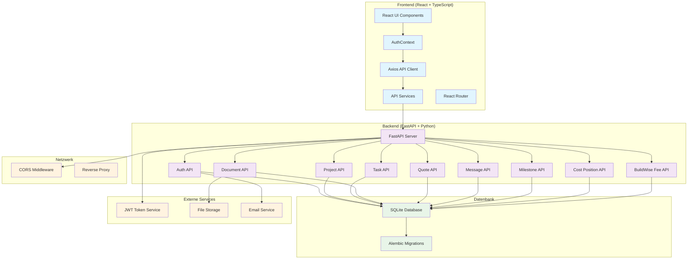
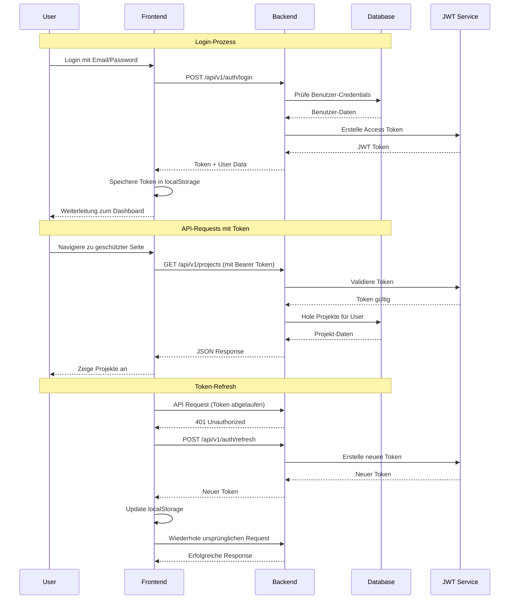
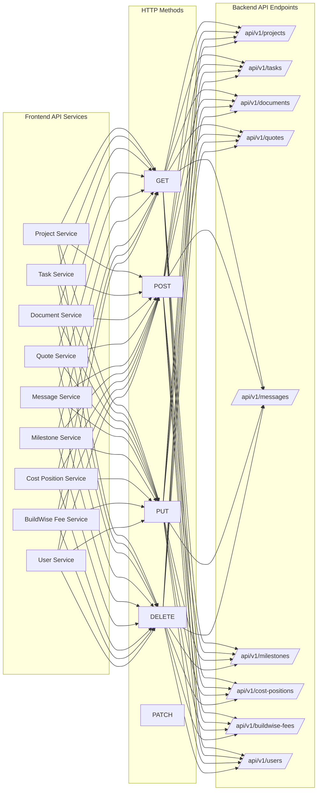
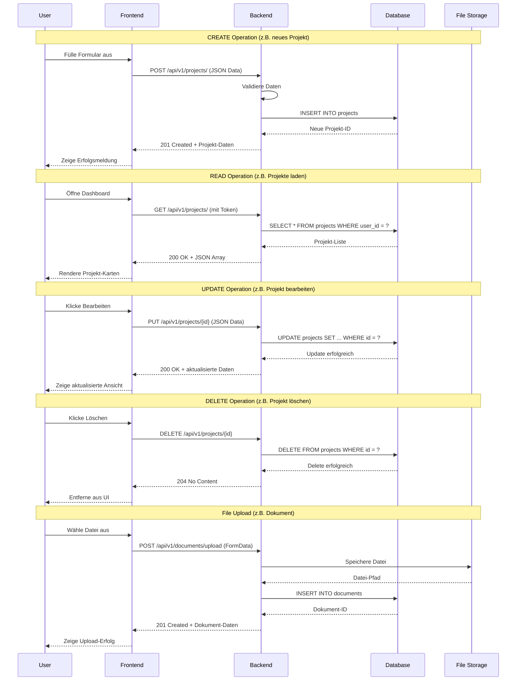
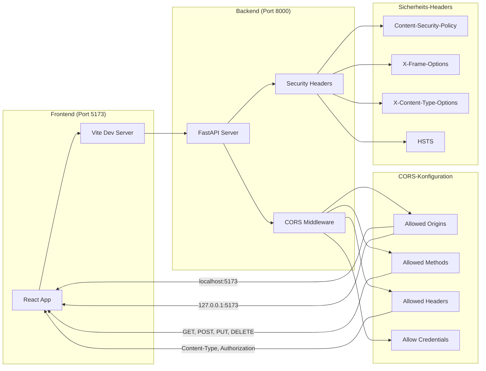
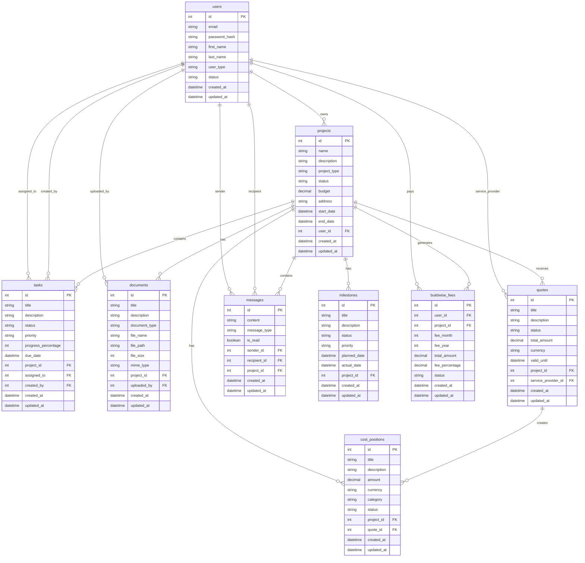
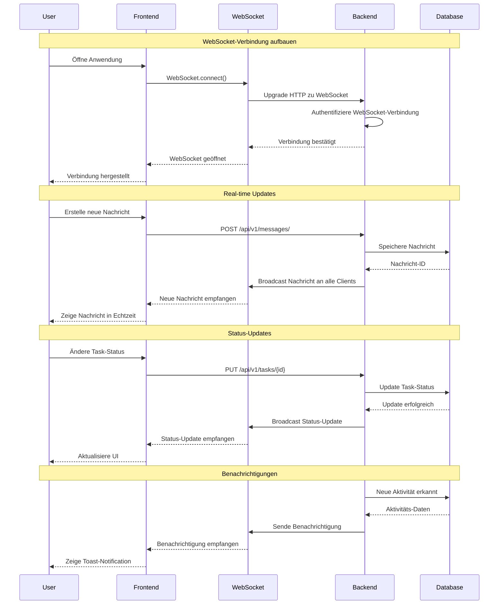
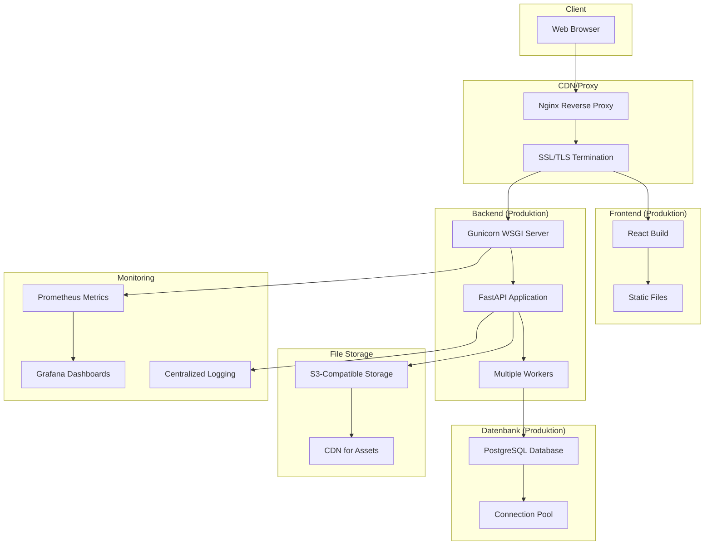
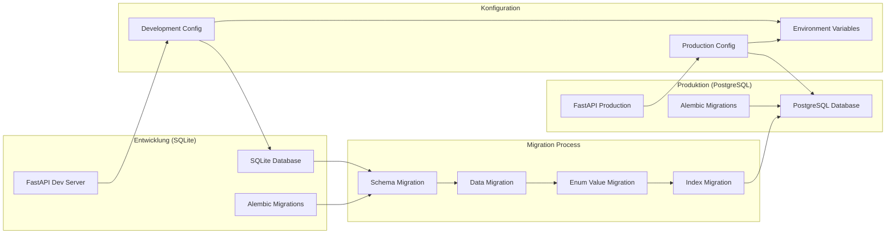

# Frontend-Backend Kommunikation in BuildWise

## Übersicht der Architektur

## Detaillierter Authentifizierungs-Flow

## API-Endpunkt Kommunikation

## Datenfluss bei CRUD-Operationen

## Error Handling und Status Codes

```mermaid
graph TD
    subgraph "Frontend Error Handling"
        AxiosInterceptor[Axios Response Interceptor]
        ErrorBoundary[React Error Boundary]
        ToastNotifications[Toast Notifications]
        RetryLogic[Retry Logic]
    end

    subgraph "Backend Error Responses"
        ValidationError[422 Validation Error]
        UnauthorizedError[401 Unauthorized]
        ForbiddenError[403 Forbidden]
        NotFoundError[404 Not Found]
        ServerError[500 Server Error]
        DatabaseError[Database Connection Error]
    end

    subgraph "HTTP Status Codes"
        Success200[200 OK]
        Created201[201 Created]
        NoContent204[204 No Content]
        BadRequest400[400 Bad Request]
        Unauthorized401[401 Unauthorized]
        Forbidden403[403 Forbidden]
        NotFound404[404 Not Found]
        Conflict409[409 Conflict]
        Unprocessable422[422 Unprocessable Entity]
        ServerError500[500 Internal Server Error]
    end

    AxiosInterceptor --> ValidationError
    AxiosInterceptor --> UnauthorizedError
    AxiosInterceptor --> ForbiddenError
    AxiosInterceptor --> NotFoundError
    AxiosInterceptor --> ServerError
    AxiosInterceptor --> DatabaseError

    ValidationError --> Unprocessable422
    UnauthorizedError --> Unauthorized401
    ForbiddenError --> Forbidden403
    NotFoundError --> NotFound404
    ServerError --> ServerError500
    DatabaseError --> ServerError500

    ErrorBoundary --> ToastNotifications
    AxiosInterceptor --> RetryLogic
    RetryLogic --> AxiosInterceptor
```

## CORS und Sicherheits-Konfiguration

## Datenbank-Schema und Beziehungen

## Real-time Kommunikation (WebSocket)

## Deployment und Produktions-Architektur

## Migration von SQLite zu PostgreSQL

## Zusammenfassung der Kommunikations-Patterns

### 1. **RESTful API-Kommunikation**
- Frontend sendet HTTP-Requests an Backend
- Backend verarbeitet Requests und sendet JSON-Responses
- Standardisierte HTTP-Status-Codes für Fehlerbehandlung

### 2. **Authentifizierung & Autorisierung**
- JWT-Token-basierte Authentifizierung
- Automatische Token-Erneuerung im Frontend
- Rollenbasierte Zugriffskontrolle im Backend

### 3. **Real-time Updates**
- WebSocket-Verbindung für Echtzeit-Updates
- Broadcast von Änderungen an alle verbundenen Clients
- Fallback auf Polling bei WebSocket-Ausfall

### 4. **Error Handling**
- Zentrale Fehlerbehandlung im Frontend
- Strukturierte Error-Responses vom Backend
- Benutzerfreundliche Fehlermeldungen

### 5. **Datei-Upload**
- Multipart-Form-Data für Datei-Uploads
- Backend-Validierung von Dateitypen und -größen
- Sichere Dateispeicherung mit eindeutigen Namen

### 6. **CORS & Sicherheit**
- Konfigurierte CORS-Policies für Cross-Origin-Requests
- Security-Headers für XSS-Schutz
- HTTPS in Produktion

### 7. **Datenbank-Integration**
- SQLAlchemy ORM für Datenbankoperationen
- Alembic für Schema-Migrationen
- Connection-Pooling für Performance

Diese Architektur ermöglicht eine skalierbare, sichere und wartbare Kommunikation zwischen Frontend und Backend in BuildWise. 