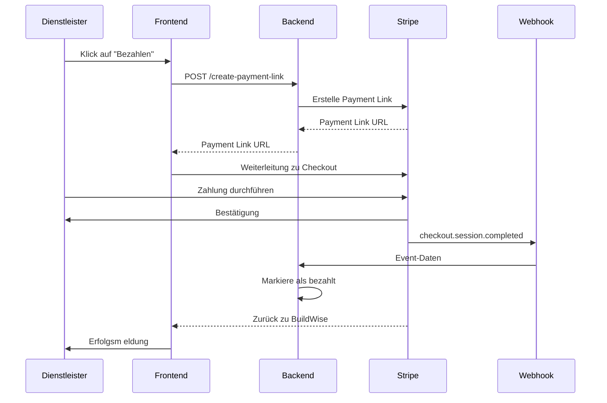

# Stripe Payment Integration für BuildWise Gebühren

## 📋 Übersicht

Diese Dokumentation beschreibt die vollständige Integration von Stripe Payment Links in die BuildWise-Plattform zur Abrechnung von Vermittlungsgebühren.

## 🎯 Funktionsumfang

### Implementierte Features

1. **Payment Link Erstellung**
   - Automatische Generierung von Stripe Payment Links für offene Gebühren
   - Unterstützung für Kreditkarten und SEPA-Lastschrift
   - Sichere Speicherung von Payment Link IDs und URLs in der Datenbank

2. **Zahlungsabwicklung**
   - Weiterleitung zu Stripe-Checkout-Seite
   - Automatische Rückkehr nach erfolgreicher Zahlung
   - Webhook-basierte Statusaktualisierung

3. **Statusverwaltung**
   - Automatische Markierung als "bezahlt" nach erfolgreicher Zahlung
   - Speicherung von Zahlungsmethode und Payment Intent ID
   - Manuelle Markierung als bezahlt weiterhin möglich

## 🏗️ Architektur

### Backend-Komponenten

#### 1. Stripe Service (`app/services/stripe_service.py`)
Zentrale Service-Klasse für Stripe-Integration:
- `create_payment_link()` - Erstellt Payment Links
- `verify_webhook_signature()` - Verifiziert Webhook-Signaturen
- `process_payment_success()` - Verarbeitet erfolgreiche Zahlungen

#### 2. API Endpunkte (`app/api/buildwise_fees.py`)
- `POST /buildwise-fees/{fee_id}/create-payment-link` - Erstellt Payment Link
- `GET /buildwise-fees/{fee_id}/payment-status` - Holt Zahlungsstatus
- `POST /buildwise-fees/stripe-webhook` - Webhook für Stripe Events

#### 3. Datenbank-Modell (`app/models/buildwise_fee.py`)
Neue Felder:
```python
stripe_payment_link_id = Column(String(255), index=True)
stripe_payment_link_url = Column(String(500))
stripe_payment_intent_id = Column(String(255), index=True)
stripe_checkout_session_id = Column(String(255), index=True)
payment_method = Column(String(50))
```

### Frontend-Komponenten

#### 1. Stripe Payment Service (`Frontend/src/services/stripePaymentService.ts`)
TypeScript-Service für Frontend-Integration:
- `createPaymentLink()` - API-Call zum Erstellen von Payment Links
- `startPaymentProcess()` - Initiiert Zahlungsprozess
- `checkPaymentSuccess()` - Prüft auf erfolgreiche Zahlung

#### 2. UI-Integration (`Frontend/src/pages/ServiceProviderBuildWiseFees.tsx`)
- **Zahlungs-Button**: Prominenter Button mit Stripe-Branding
- **Status-Feedback**: Loading-States und Erfolgs-/Fehlermeldungen
- **Automatische Aktualisierung**: Nach erfolgreicher Zahlung

## 🔐 Sicherheit

### API Keys
- **Public Key**: Für Frontend (sichtbar im Browser)
- **Secret Key**: Nur im Backend (nie im Frontend!)
- **Webhook Secret**: Zur Verifizierung von Webhook-Signaturen

### Best Practices
1. ✅ API Keys in Environment-Variablen speichern
2. ✅ Webhook-Signaturen verifizieren
3. ✅ Beträge serverseitig berechnen (nie aus Frontend übernehmen)
4. ✅ Payment Intent IDs in Datenbank speichern
5. ✅ Idempotenz bei Webhook-Verarbeitung sicherstellen

## 🚀 Installation & Setup

### 1. Backend-Setup

#### Dependencies installieren:
```bash
pip install -r requirements.txt
```

#### Datenbank migrieren:
```bash
python add_stripe_payment_columns.py
```

#### Umgebungsvariablen (`.env`):
```env
STRIPE_SECRET_KEY=sk_test_51RmqhBD1cfnpqPDcNBjCVI3uNYCuvpqU2bdrTF2sugjOi5BiGtMF1kaiiHVpxR8dzkgXO634carUE57oyEDdmiQV00XaE5SZfO
STRIPE_PUBLISHABLE_KEY=pk_test_51RmqhBD1cfnpqPDcdZxBM4ZNiPrqhu6w4oiTMQGbTnxfbAzN0Lq6Q0yJOmtags79C2R8SLUmLd4n3oUurQ71ryBp00yCLKw9UK
```

### 2. Frontend-Setup

#### TypeScript-Dateien wurden bereits erstellt:
- `Frontend/src/services/stripePaymentService.ts`
- UI-Updates in `ServiceProviderBuildWiseFees.tsx`

### 3. Stripe Dashboard Setup

#### Webhook einrichten:
1. Gehe zu [Stripe Dashboard](https://dashboard.stripe.com/test/webhooks)
2. Klicke auf "Add endpoint"
3. URL: `https://your-domain.com/api/v1/buildwise-fees/stripe-webhook`
4. Events auswählen:
   - `checkout.session.completed`
   - `payment_intent.succeeded`
5. Webhook-Secret kopieren und in `.env` speichern

## 📊 Workflow

### Zahlungsprozess



## 🔍 Testing

### Test-Kreditkarten

Stripe bietet Test-Kreditkarten für verschiedene Szenarien:

| Karte | Nummer | Ergebnis |
|-------|--------|----------|
| Erfolg | 4242 4242 4242 4242 | Zahlung erfolgreich |
| Declined | 4000 0000 0000 0002 | Karte abgelehnt |
| 3D Secure | 4000 0027 6000 3184 | 3D Secure erforderlich |

**Weitere Test-Daten:**
- CVV: Beliebige 3 Ziffern (z.B. 123)
- Ablaufdatum: Beliebiges zukünftiges Datum
- PLZ: Beliebige 5 Ziffern

### Webhook-Testing lokal

Für lokale Entwicklung:
```bash
# Stripe CLI installieren
brew install stripe/stripe-cli/stripe

# Login
stripe login

# Webhook forwarding
stripe listen --forward-to localhost:8000/api/v1/buildwise-fees/stripe-webhook
```

## 📝 API-Referenz

### POST /buildwise-fees/{fee_id}/create-payment-link

Erstellt einen Stripe Payment Link für eine Gebühr.

**Request:**
```http
POST /api/v1/buildwise-fees/123/create-payment-link
Authorization: Bearer <token>
```

**Response (Success):**
```json
{
  "success": true,
  "payment_link_url": "https://buy.stripe.com/test_xxxxx",
  "payment_link_id": "plink_xxxxx",
  "amount": 470.00,
  "currency": "EUR",
  "message": "Payment Link erfolgreich erstellt"
}
```

**Response (Error):**
```json
{
  "detail": "Diese Gebühr wurde bereits bezahlt"
}
```

### GET /buildwise-fees/{fee_id}/payment-status

Holt den aktuellen Zahlungsstatus.

**Response:**
```json
{
  "fee_id": 123,
  "status": "paid",
  "payment_link_id": "plink_xxxxx",
  "payment_link_url": "https://buy.stripe.com/test_xxxxx",
  "payment_intent_id": "pi_xxxxx",
  "payment_date": "2024-01-15",
  "payment_method": "card",
  "amount": 470.00,
  "gross_amount": 508.07,
  "currency": "EUR"
}
```

### POST /buildwise-fees/stripe-webhook

Webhook-Endpunkt für Stripe Events.

**Headers:**
```
stripe-signature: t=xxx,v1=xxx
```

**Payload:**
```json
{
  "type": "checkout.session.completed",
  "data": {
    "object": {
      "id": "cs_xxxxx",
      "metadata": {
        "fee_id": "123",
        "invoice_number": "BW-000123"
      },
      "payment_intent": "pi_xxxxx"
    }
  }
}
```

## 🎨 UI-Komponenten

### Zahlungs-Button

Der Button wird nur für offene, ausstehende oder überfällige Gebühren angezeigt:

```tsx
{(fee.status === 'open' || fee.status === 'overdue' || fee.status === 'pending') && (
  <button 
    onClick={() => handlePayWithStripe(fee)}
    disabled={processingPayment === fee.id}
    className="flex items-center space-x-1 px-3 py-1 bg-gradient-to-r from-indigo-600 to-purple-600 text-white rounded-lg hover:from-indigo-700 hover:to-purple-700 transition-all transform hover:scale-105"
    title="Jetzt mit Stripe bezahlen"
  >
    <CreditCard className="w-4 h-4" />
    <span className="text-xs font-medium">Bezahlen</span>
    <ExternalLink className="w-3 h-3" />
  </button>
)}
```

### Status-Badges

- 🟢 **Bezahlt**: Grüner Badge mit Checkmark
- 🔵 **Offen**: Blauer Badge mit Clock
- 🟡 **Ausstehend**: Gelber Badge mit Clock
- 🔴 **Überfällig**: Roter Badge mit Warning

## 🐛 Troubleshooting

### Problem: Payment Link wird nicht erstellt

**Lösung:**
1. Prüfe API Keys in `app/core/config.py`
2. Stelle sicher, dass Stripe-Package installiert ist: `pip install stripe`
3. Prüfe Backend-Logs auf Fehler

### Problem: Webhook wird nicht empfangen

**Lösung:**
1. Prüfe Webhook-URL in Stripe Dashboard
2. Stelle sicher, dass Endpunkt öffentlich erreichbar ist
3. Verwende `stripe listen` für lokale Tests
4. Prüfe Webhook-Secret in Config

### Problem: Zahlung wird nicht als "bezahlt" markiert

**Lösung:**
1. Prüfe Webhook-Logs im Backend
2. Stelle sicher, dass `checkout.session.completed` Event empfangen wird
3. Prüfe `metadata.fee_id` im Webhook-Payload
4. Manuell über "Als bezahlt markieren" Button setzen

## 📚 Weitere Ressourcen

- [Stripe Documentation](https://docs.stripe.com/)
- [Payment Links Guide](https://stripe.com/docs/payment-links)
- [Webhooks Best Practices](https://stripe.com/docs/webhooks/best-practices)
- [Test Cards](https://stripe.com/docs/testing)

## ✅ Checkliste für Production

- [ ] Stripe Secret Keys in Umgebungsvariablen
- [ ] Webhook-Secret konfiguriert
- [ ] Webhook-Endpunkt öffentlich erreichbar
- [ ] SSL/TLS aktiviert (HTTPS)
- [ ] Datenbank-Migration ausgeführt
- [ ] Test-Zahlungen durchgeführt
- [ ] Error-Handling getestet
- [ ] Logging konfiguriert
- [ ] Monitoring für Webhooks eingerichtet
- [ ] DSGVO-konform (Datenspeicherung)

## 🔄 Changelog

### Version 1.0 (2024-10-02)
- ✅ Initiale Stripe-Integration
- ✅ Payment Links für BuildWise Gebühren
- ✅ Webhook-basierte Zahlungsbestätigung
- ✅ UI-Integration mit Zahlungs-Button
- ✅ Automatische Statusaktualisierung

## 👥 Support

Bei Fragen oder Problemen:
1. Prüfe diese Dokumentation
2. Schaue in die Stripe-Dokumentation
3. Prüfe Backend-Logs
4. Kontaktiere das Entwicklungsteam

---

**Erstellt:** 2. Oktober 2024  
**Version:** 1.0  
**Status:** Production Ready ✅

