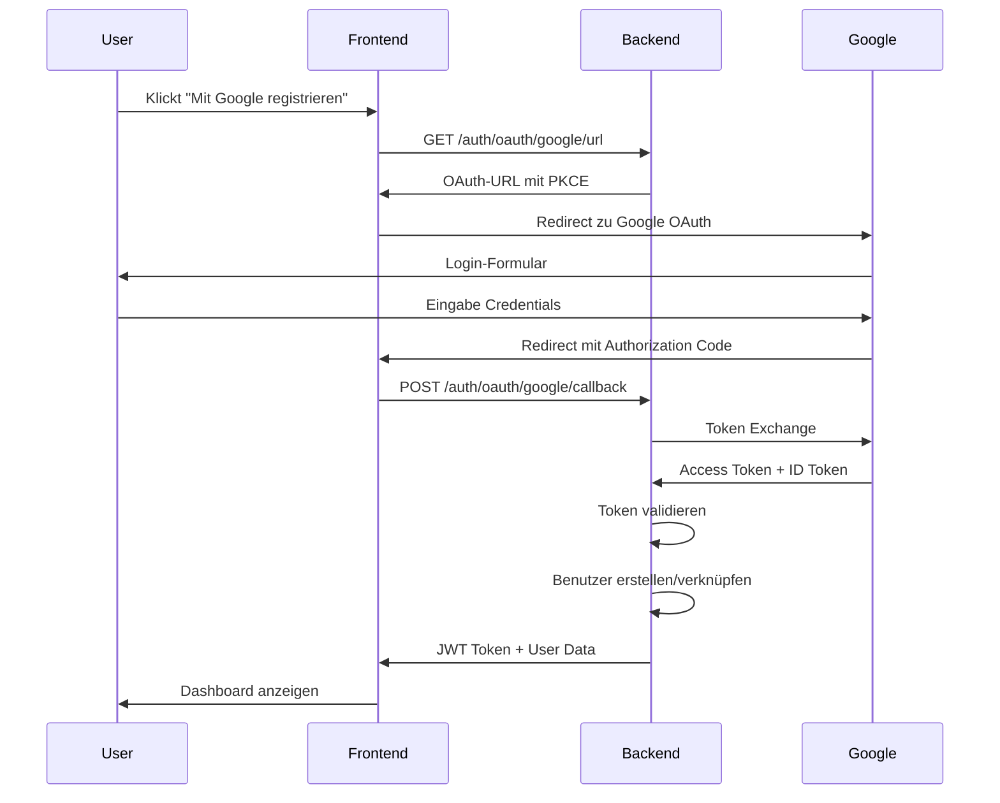
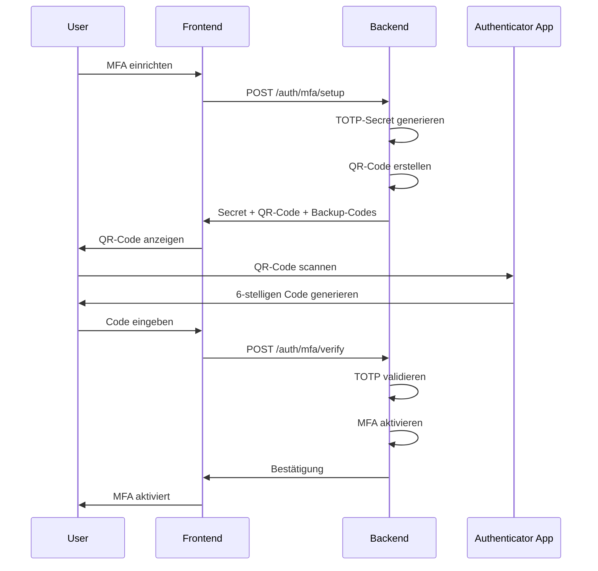
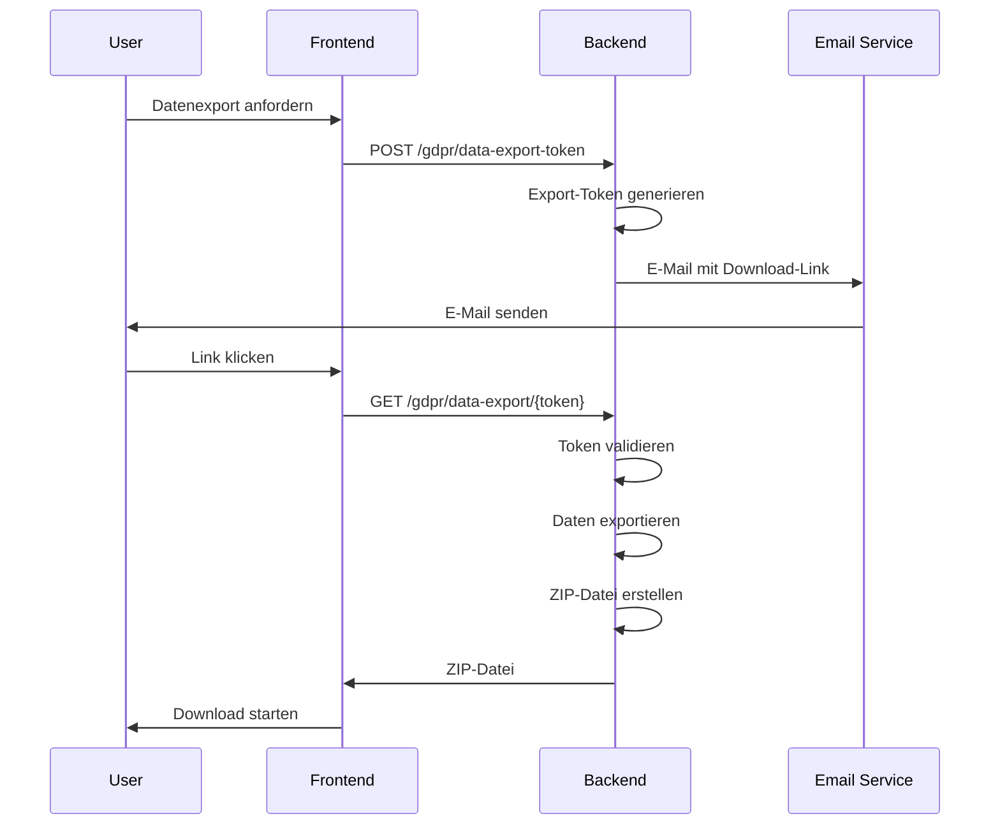

# Praxisbeispiel: Multi-Login Userflow

## Szenario: Max Mustermann - Neuer Benutzer

### 1. Registrierung über Google OAuth

**Schritt 1: Benutzer besucht BuildWise**
```
Max öffnet https://buildwise.de und klickt auf "Registrieren"
```

**Schritt 2: Login-Optionen**
```
Max sieht drei Optionen:
☐ Mit E-Mail registrieren
☐ Mit Google registrieren  
☐ Mit Microsoft registrieren

Max wählt "Mit Google registrieren"
```

**Schritt 3: OAuth-Flow**
```
1. BuildWise generiert OAuth-URL mit PKCE
2. Max wird zu Google weitergeleitet
3. Max loggt sich bei Google ein
4. Google fragt nach Einwilligung für BuildWise
5. Max bestätigt die Einwilligung
6. Google leitet zurück zu BuildWise mit Authorization Code
```

**Schritt 4: Benutzererstellung**
```
BuildWise verarbeitet den OAuth-Callback:
1. Authorization Code gegen Access Token tauschen
2. Benutzerinformationen von Google abrufen
3. Benutzer in Datenbank erstellen:
   - Email: max.mustermann@gmail.com
   - Name: Max Mustermann
   - Auth Provider: google
   - Google Sub: 123456789
   - Implizite DSGVO-Einwilligung
4. JWT-Token generieren
5. Audit-Log erstellen
```

**Schritt 5: Willkommensseite**
```
Max wird zur Willkommensseite weitergeleitet:
"Willkommen bei BuildWise, Max!

Ihr Konto wurde erfolgreich mit Google verknüpft.
Sie können sich zukünftig mit Google anmelden."
```

### 2. Erste Anmeldung

**Schritt 1: Login-Seite**
```
Max besucht https://buildwise.de und klickt "Anmelden"
```

**Schritt 2: Login-Optionen**
```
Max sieht:
☐ Mit E-Mail anmelden
☐ Mit Google anmelden
☐ Mit Microsoft anmelden

Max wählt "Mit Google anmelden"
```

**Schritt 3: OAuth-Login**
```
1. OAuth-Flow wie bei Registrierung
2. BuildWise erkennt existierenden Benutzer
3. Login-Zeit aktualisiert
4. Audit-Log erstellt
5. Dashboard angezeigt
```

### 3. MFA-Setup (Optional)

**Schritt 1: MFA-Empfehlung**
```
BuildWise zeigt: "Für zusätzliche Sicherheit empfehlen wir Multi-Factor Authentication"
Max klickt "MFA einrichten"
```

**Schritt 2: QR-Code-Setup**
```
1. BuildWise generiert TOTP-Secret
2. QR-Code wird angezeigt
3. Max scannt QR-Code mit Google Authenticator
4. Max gibt 6-stelligen Code ein
5. MFA wird aktiviert
6. Backup-Codes werden angezeigt und gespeichert
```

**Schritt 3: MFA-Bestätigung**
```
"Multi-Factor Authentication erfolgreich eingerichtet!
Ihre Backup-Codes wurden sicher gespeichert.
Bei Verlust Ihres Geräts können Sie diese Codes verwenden."
```

### 4. DSGVO-Funktionen nutzen

**Schritt 1: Datenexport anfordern**
```
Max geht zu "Einstellungen" → "Datenschutz"
Max klickt "Meine Daten exportieren"
```

**Schritt 2: Export-Prozess**
```
1. BuildWise generiert Export-Token
2. E-Mail mit Download-Link wird gesendet
3. Max klickt Link in E-Mail
4. ZIP-Datei mit allen Daten wird heruntergeladen
5. Audit-Log erstellt
```

**Schritt 3: Einwilligungen verwalten**
```
Max kann Einwilligungen verwalten:
☑ Datenverarbeitung (erforderlich)
☑ Marketing-E-Mails
☑ Analytics-Cookies
☑ Third-Party-Services

Max kann einzelne Einwilligungen widerrufen
```

### 5. Social-Account verknüpfen

**Schritt 1: Microsoft-Account hinzufügen**
```
Max geht zu "Einstellungen" → "Anmeldung"
Max klickt "Microsoft-Account hinzufügen"
```

**Schritt 2: Verknüpfungsprozess**
```
1. OAuth-Flow für Microsoft
2. BuildWise prüft E-Mail-Adresse
3. E-Mail muss mit bestehendem Konto übereinstimmen
4. Microsoft-Account wird verknüpft
5. Audit-Log erstellt
```

**Schritt 3: Bestätigung**
```
"Microsoft-Account erfolgreich verknüpft!
Sie können sich jetzt auch mit Microsoft anmelden."
```

### 6. Sicherheitsvorfall

**Szenario: Verdächtige Anmeldung**
```
Max erhält E-Mail: "Neue Anmeldung von unbekanntem Gerät"
Max klickt "Nicht ich" → Konto wird gesperrt
Max meldet sich bei Support
```

**Schritt 1: Account-Sperrung**
```
1. BuildWise erkennt verdächtige Aktivität
2. Account wird temporär gesperrt
3. E-Mail-Benachrichtigung an Max
4. Audit-Log mit hohem Risiko-Level
```

**Schritt 2: Account-Wiederherstellung**
```
1. Max kontaktiert Support
2. Identität wird verifiziert
3. Account wird entsperrt
4. Alle Sessions werden invalidiert
5. Max muss sich neu anmelden
```

### 7. Datenlöschung beantragen

**Schritt 1: Löschung beantragen**
```
Max geht zu "Einstellungen" → "Datenschutz"
Max klickt "Konto löschen"
```

**Schritt 2: Bestätigungsprozess**
```
1. BuildWise zeigt Warnung: "Diese Aktion ist unwiderruflich"
2. Max muss Passwort eingeben
3. Max bestätigt Löschung
4. Löschung wird für 30 Tage verzögert
5. E-Mail-Bestätigung wird gesendet
```

**Schritt 3: Löschungsprozess**
```
Nach 30 Tagen:
1. Alle persönlichen Daten werden anonymisiert
2. E-Mail wird zu anonym_123@deleted.buildwise.de
3. Name wird zu "Anonym Benutzer"
4. Audit-Log erstellt
5. Benutzer kann sich nicht mehr anmelden
```

## Technische Details

### OAuth-Flow (Google)



### MFA-Flow



### DSGVO-Export-Flow



## Erfolgsmetriken

### Benutzerfreundlichkeit
- **Registrierungszeit**: < 2 Minuten
- **Login-Zeit**: < 30 Sekunden
- **MFA-Setup-Zeit**: < 3 Minuten
- **Datenexport-Zeit**: < 5 Minuten

### Sicherheit
- **Failed-Login-Rate**: < 5%
- **MFA-Adoption**: > 20%
- **Security-Incidents**: < 1 pro Monat
- **Account-Lockouts**: < 1% der Benutzer

### DSGVO-Compliance
- **Export-Requests**: < 1% der Benutzer
- **Deletion-Requests**: < 0.5% der Benutzer
- **Consent-Update-Rate**: > 95%
- **Audit-Log-Completeness**: 100%

## Troubleshooting

### Häufige Probleme

**OAuth-Fehler**
```
Problem: "OAuth-Fehler: invalid_client"
Lösung: Client ID und Secret in .env prüfen
```

**MFA-Probleme**
```
Problem: "Ungültiger MFA-Code"
Lösung: Zeit-Synchronisation prüfen, Backup-Code verwenden
```

**DSGVO-Export-Fehler**
```
Problem: "Export-Token abgelaufen"
Lösung: Neuen Export-Token anfordern
```

### Support-Eskalation

1. **Level 1**: Automatisierte Fehlerbehebung
2. **Level 2**: Technischer Support
3. **Level 3**: Security-Team
4. **Level 4**: Legal-Team (DSGVO-Fragen) 